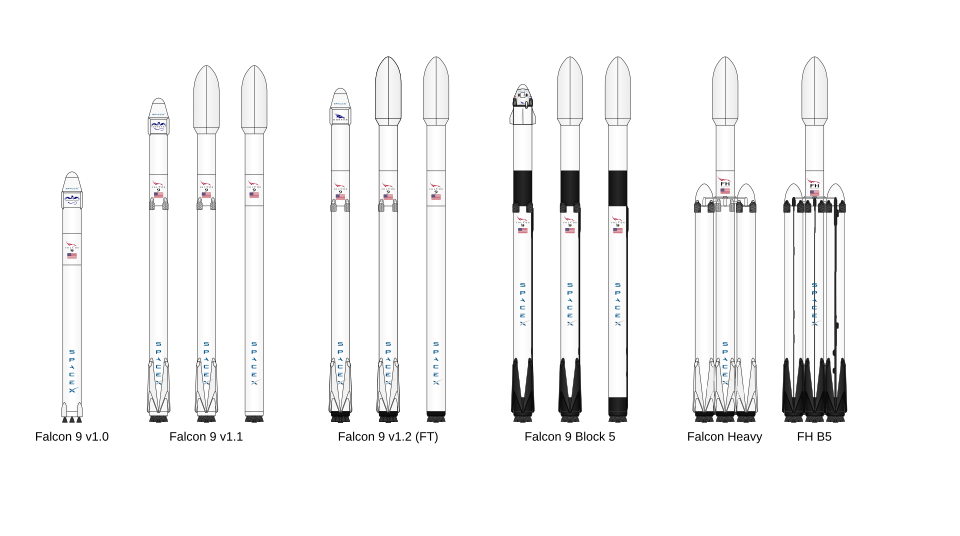
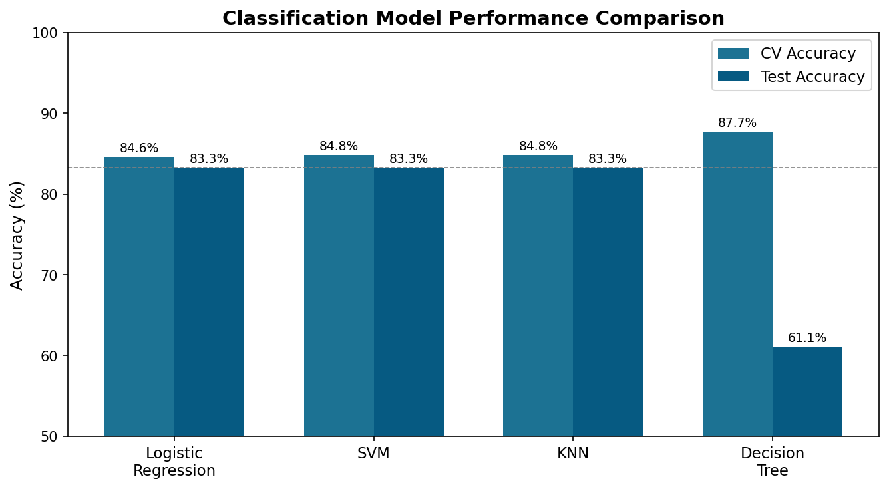
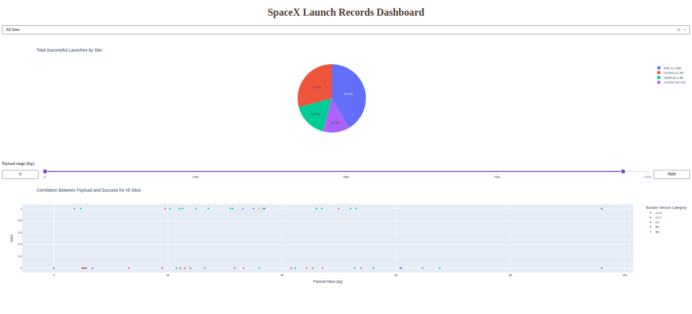

# SpaceX Falcon 9 First Stage Landing Prediction

> Predicting whether a Falcon 9 booster will successfully land — 
> and what that means for competitive launch pricing.



---

## Project Overview

SpaceX advertises Falcon 9 launches at **$62 million**, compared to competitors 
charging upward of **$165 million**. The primary source of this cost advantage is 
first-stage reusability — if the booster lands successfully, it can be refurbished 
and reflown. This project builds a machine learning pipeline to predict landing 
success from publicly available launch data, enabling a competing provider to 
estimate SpaceX's true cost per launch and price bids accordingly.

---

## Table of Contents

- [Project Overview](#project-overview)
- [Dataset](#dataset)
- [Methodology](#methodology)
- [Results](#results)
- [Dashboard](#dashboard)
- [Repository Structure](#repository-structure)
- [How to Run](#how-to-run)
- [Technologies Used](#technologies-used)

---

## Dataset

Data was collected from two sources:

**SpaceX REST API** (`api.spacexdata.com/v4`)  
Structured launch records including booster version, payload mass, orbit type, 
launch site coordinates, and landing outcomes. Nested API calls enriched each 
launch record with rocket, launchpad, payload, and core details.

**Wikipedia Web Scraping**  
Historical Falcon 9 and Falcon Heavy launch records scraped from the Wikipedia 
page snapshot dated June 9, 2021, using BeautifulSoup.

| Property | Value |
|---|---|
| Total records | 90 launches |
| Date range | June 2010 – March 2021 |
| Features | 17 (pre-encoding) |
| Launch sites | 4 (CCAFS LC-40, CCAFS SLC-40, KSC LC-39A, VAFB SLC-4E) |
| Target variable | Binary — 1 (successful landing) / 0 (failure or no attempt) |

---

## Methodology
**1. Data Collection**  
REST API calls + BeautifulSoup web scraping to build a unified launch dataset.

**2. Data Wrangling**  
Handled missing values (LandingPad: 28.9% null — expected for ocean landings). 
Engineered a binary `Class` label from 8 raw landing outcome categories.

**3. Exploratory Data Analysis**  
Matplotlib/Seaborn visualizations and SQLite queries to uncover patterns across 
flight number, payload mass, orbit type, launch site, and time.

**4. Interactive Visual Analytics**  
- **Folium** — interactive maps showing launch site locations, color-coded outcomes, 
  and proximity measurements to coastlines, highways, and railways
- **Plotly Dash** — interactive dashboard with site-level pie charts and 
  payload-outcome scatter plots with a range slider

**5. Predictive Modeling**  
Four classifiers tuned with GridSearchCV (10-fold cross-validation):
- Logistic Regression
- Support Vector Machine (SVM)
- Decision Tree
- K-Nearest Neighbors (KNN)

Features standardized with `StandardScaler`. Categorical variables one-hot encoded 
(~80 features post-encoding).

---

## Results

### EDA Key Findings

- Launch success rate climbed from near **0% in 2010–2012** to approximately 
  **100% by 2020**, reflecting SpaceX's compounding engineering improvements
- **KSC LC-39A** has the highest success ratio of all four sites
- Higher flight numbers correlate strongly with success — experience is the 
  strongest single predictor
- Mid-range payloads (2,000–5,500 kg) to LEO/ISS orbits yield the most 
  consistent successes

### Model Performance

| Model | CV Accuracy | Test Accuracy |
|---|---|---|
| Logistic Regression | 84.6% | **83.3%** |
| SVM | 84.8% | **83.3%** |
| KNN | 84.8% | **83.3%** |
| Decision Tree | 87.7% | 61.1% |



**Best model for deployment: Logistic Regression / SVM / KNN** — all three 
generalize equally well at 83.3% test accuracy. The Decision Tree's significant 
drop from CV to test accuracy indicates overfitting on this dataset size.

---

## Dashboard

An interactive Plotly Dash application for exploring launch outcomes.



**Features:**
- Dropdown to filter by launch site or view all sites
- Pie chart showing success counts or success/failure ratio per site
- Payload range slider (0–10,000 kg)
- Scatter plot showing payload vs. outcome colored by booster version

**To run locally:**
```bash
pip install dash plotly pandas
python dashboard/spacex_dash_app.py
# Open http://127.0.0.1:8050
```
---

## How to Run

**Prerequisites:** Python 3.8+

```bash
# 1. Clone the repository
git clone https://github.com/yourusername/spacex-falcon9-landing-prediction.git
cd spacex-falcon9-landing-prediction

# 2. Install dependencies
pip install pandas numpy matplotlib seaborn scikit-learn \
            folium dash plotly requests beautifulsoup4 \
            ipython-sql sqlalchemy

# 3. Run notebooks in order (01 → 07)
jupyter notebook

# 4. Launch the dashboard
python dashboard/spacex_dash_app.py
```

> **Note:** Notebooks 01 and 02 make live API/web requests. 
> Notebooks 03–07 use the CSV files in `/data/` and can be run offline.

---

## Technologies Used

| Category | Tools |
|---|---|
| Data Collection | Python `requests`, `BeautifulSoup4`, SpaceX REST API |
| Data Processing | `pandas`, `numpy` |
| Visualization | `matplotlib`, `seaborn`, `plotly` |
| Interactive Maps | `folium` |
| Dashboard | `Dash` (Plotly) |
| Database/SQL | `SQLite`, `ipython-sql` |
| Machine Learning | `scikit-learn` (LR, SVM, DT, KNN, GridSearchCV) |
| Environment | Jupyter Notebook |

---

## Acknowledgements

This project was completed as the capstone for the 
[IBM Data Science Professional Certificate] 
on Coursera. Launch data provided by the 
[SpaceX REST API](https://github.com/r-spacex/SpaceX-API) and Wikipedia.
